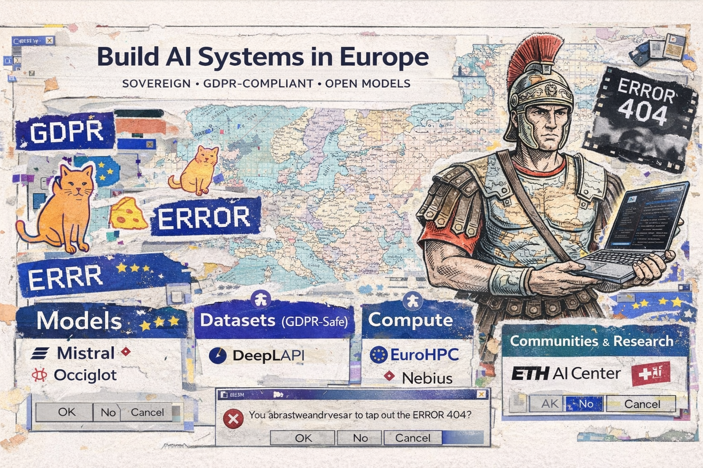

# Awesome Ai in Europe

> List of resources for building AI systems in Europe: infrastructure, models, datasets, compliance tooling, funding, and research labs.

## At a glance

| Section | Focus | Count |
| --- | --- | ---: |
| [Inference Providers](#inference-providers) | EU-hosted APIs, sovereign clouds, and managed model access | 17 |
| [Datasets (GDPR-Safe)](#datasets-gdpr-safe) | Licensed corpora, speech, and legal data | 10 |
| [EU AI Act Tooling](#eu-ai-act-tooling) | Risk classification, documentation, audit, and assessment | 10 |
| [Grants & Compute](#grants--compute) | Funding programs and European supercomputing access | 23 |
| [Models](#models) | Open models and model families for European languages | 46 |
| [Multilingual Resources](#multilingual-resources) | Language-tech projects and Europe-wide corpora | 2 |
| [Research Labs & Institutes](#research-labs--institutes) | Academic and applied AI research hubs | 31 |
| [Communities & Events](#communities--events) | Ecosystem groups, conferences, and media | 20 |

## Featured Picks

| Pick | Section | Why it stands out |
| --- | --- | --- |
| [Infomaniak AI Services](https://www.infomaniak.com/en/hosting/ai-services) | Inference Providers | Swiss privacy-first managed inference with a free tier and Geneva hosting. |
| [ETH AI Center](https://ai.ethz.ch/) | Research Labs & Institutes | Switzerland's flagship AI research hub with strong trustworthy-AI credentials. |
| [JUPITER (FZJ)](https://www.fz-juelich.de/en/ias/jsc/jupiter) | Grants & Compute | Europe's first exascale system, designed for large-scale AI training and research. |
| [Occiglot](https://occiglot.eu/) | Models | Pan-European foundation-model initiative for all 24 official EU languages. |
| [SwissDial](https://mtc.ethz.ch/publications/open-source/swiss-dial.html) | Datasets (GDPR-Safe) | High-value Swiss German dialect dataset for speech and text research. |
| [Swiss AI Association](https://swissai.ch/) | Communities & Events | Switzerland's primary AI ecosystem body for research, business, and policy. |

The section lists below keep each entry to one line, with tags and licensing notes to make trust, openness, and geography easy to scan at a glance.

## Browse by Geography

| Region | What to look for |
| --- | --- |
| Switzerland | Sovereign inference, Swiss-language resources, applied AI hubs, and research bodies |
| Nordics | Nordic language models, regional corpora, and strong public compute programs |
| DACH | German-language models, enterprise inference, and AI Act tooling |
| Western Europe | Major labs, enterprise AI services, and large multilingual projects |
| Southern Europe | Catalan, Spanish, Italian, Portuguese, and Greek resources |
| Central & Eastern Europe | Slavic, Baltic, and Balkan models, labs, and communities |
| Pan-European | EU-wide datasets, compute, funding, and foundational models |

## Contents

- [At a glance](#at-a-glance)
- [Featured Picks](#featured-picks)
- [Browse by Geography](#browse-by-geography)
- [Inference Providers](#inference-providers)
- [Datasets (GDPR-Safe)](#datasets-gdpr-safe)
- [EU AI Act Tooling](#eu-ai-act-tooling)
- [Grants & Compute](#grants--compute)
- [Models](#models)
- [Multilingual Resources](#multilingual-resources)
- [Research Labs & Institutes](#research-labs--institutes)
- [Communities & Events](#communities--events)
- [Contributing](#contributing)
- [Scope & Disclaimer](#scope--disclaimer)
- [License](#license)

---

## Inference Providers

EU-based or EU-compliant LLM inference hosts.

- [Mistral AI](https://mistral.ai/) — French AI company and one of Europe's best-known frontier-model labs, offering EU-hosted API endpoints. `[EU-hosted]` `[Open weights]`
- [Aleph Alpha](https://aleph-alpha.com/) — German sovereign AI company known for enterprise LLMs and regulated deployment support. `[EU-hosted]` `[GDPR-DPA]`
- [OVHcloud AI Endpoints](https://www.ovhcloud.com/en/public-cloud/ai-endpoints/catalog/) — Managed AI inference on OVHcloud's EU-sovereign infrastructure with open-source models. `[EU-hosted]` `[GDPR-DPA]`
- [Scaleway Generative APIs](https://www.scaleway.com/en/generative-apis/) — French cloud provider running managed LLM inference from EU data centers. `[EU-hosted]` `[GDPR-DPA]`
- [Deutsche Telekom Industrial AI Cloud](https://www.telekom.com/en/company/details/industrial-ai-cloud-1100158) — German sovereign AI cloud from T-Systems for training and running models inside Germany. `[EU-hosted]` `[GDPR-DPA]`
- [IONOS AI Model Hub](https://cloud.ionos.com/managed/ai-model-hub) — German cloud provider offering LLM inference from EU-sovereign data centers. `[EU-hosted]` `[GDPR-DPA]`
- [Nebius AI](https://nebius.com/) — Amsterdam-headquartered AI cloud offering GPU clusters and LLM API with EU data-residency and zero-retention options. `[EU-hosted]` `[GDPR-DPA]` `[Free tier]`
- [STACKIT](https://stackit.com/en/) — German sovereign cloud platform from Schwarz Group offering scalable AI compute and model hosting. `[EU-hosted]` `[GDPR-DPA]`
- [Nscale](https://www.nscale.com/) — UK-based high-performance GPU cloud and AI infrastructure provider. `[EU-hosted]`
- [Verda (DataCrunch)](https://verda.com/) — Nordic green-compute AI cloud provider running H100 clusters in Finland on renewable energy. `[EU-hosted]` `[GDPR-DPA]`
- [Gcore Inference](https://gcore.com/) — Luxembourg-based edge and cloud AI inference platform with sovereign EU infrastructure and 200+ Tbps network. `[EU-hosted]`
- [Infomaniak AI Services](https://www.infomaniak.com/en/hosting/ai-services) — Swiss privacy-first managed AI services from Geneva with a developer-friendly API surface. `[EU-hosted]` `[GDPR-DPA]` `[Free tier]`
- [Exoscale GPU Compute](https://www.exoscale.com/gpu/) — Swiss cloud provider offering A100/H100 GPU instances for model serving and AI workloads. `[EU-hosted]` `[GDPR-DPA]`
- [DeepL API](https://www.deepl.com/pro-api) — German translation AI platform with a widely used API for multilingual products and workflows. `[EU-hosted]` `[GDPR-DPA]`
- [Swisscom Swiss AI Platform](https://www.swisscom.ch/en/business/enterprise/offer/platforms-applications/data-driven-business/swiss-ai-platform.html) — Swisscom's sovereign AI platform from Switzerland's largest telecom operator. `[EU-hosted]` `[GDPR-DPA]`
- [Alpine AI (SwissGPT)](https://alpineai.swiss/) — Swiss-hosted enterprise LLM access platform with strong privacy positioning and multilingual support. `[EU-hosted]` `[GDPR-DPA]`
- [LightOn](https://lighton.ai/) — French enterprise AI company focused on managed LLM products and EU-hosted infrastructure. `[EU-hosted]`

## Datasets (GDPR-Safe)

Datasets with clear EU-compatible licensing for training and evaluation.

- [OPUS Corpora](https://opus.nlpl.eu/) — University of Helsinki-led collection of freely available parallel corpora for European machine translation. `Various open licenses`
- [EuroParl](https://www.statmt.org/europarl/) — Landmark parallel corpus from European Parliament proceedings in 21 EU languages. `Free for research`
- [OSCAR](https://oscar-project.org/) — Inria- and DFKI-backed open multilingual web corpus with per-language subsets and metadata. `CC0-1.0`
- [SwissDial](https://mtc.ethz.ch/publications/open-source/swiss-dial.html) — ETH Zurich corpus of spoken Swiss German dialects with audio and High German transcripts. `Research access`
- [EUR-Lex](https://eur-lex.europa.eu) — Official EU law and legal documents across all EU languages, useful for legal NLP. `Public domain (EU reuse policy)`
- [JRC-Acquis](https://joint-research-centre.ec.europa.eu/language-technology-resources/jrc-acquis_en) — European Commission parallel legal corpus covering the EU acquis in 22 languages. `Public domain`
- [Leipzig Corpora Collection](https://corpora.uni-leipzig.de/en) — German university corpus collection with comparable monolingual resources across many European languages. `Academic`
- [Europeana Data](https://pro.europeana.eu/data) — European cultural-heritage data from museums, libraries, and archives across the continent, useful for retrieval and multimodal research. `Mixed`
- [Portuguese Corpus (AC/DC)](https://www.linguateca.pt/) — Large Portuguese text corpus for NLP research from the Linguateca ecosystem. `Academic`
- [Nordic Dialect Corpus](https://www.tekstlab.uio.no/norsk/dialekt/) — University of Oslo collection of Nordic dialect recordings and transcriptions. `Academic`

## EU AI Act Tooling

Resources for EU AI Act compliance workflows built by European organizations. This section lists tools for understanding and preparing for EU AI Act requirements — it does not constitute legal advice (verify current enforcement schedule before acting).

### Risk Classification

- [ai-act-checklist](https://github.com/AlgorithmWatch/ai-act-checklist) — German open-source checklist tool from AlgorithmWatch for mapping AI systems to EU AI Act risk categories. `[Open-source]`

### Monitoring / Audit

- [COMPL-AI](https://compl-ai.org/) — ETH Zurich benchmark framework for evaluating LLM compliance with the EU AI Act, built for the Swiss research ecosystem. `[Open-source]` `[Academic]`
- [LNE AI Process Certification](https://www.lne.fr/en/service/certification/certification-processes-ai) — French national metrology lab certification covering design, development, evaluation, and maintenance processes aligned with EU AI Act trust requirements. `[Free]`
- [Z-Examen](https://z-examen.de/en/) — German research project developing a standardized testing and certification procedure for AI system quality and safety. `[Open-source]`
- [Saidot](https://www.saidot.ai/) — Finnish AI governance and transparency platform for managing risks and documentation. `[Proprietary]`
- [Enzai](https://www.enzai.ai/) — Northern Ireland-based AI governance platform for compliance and regulatory risk management. `[Proprietary]`
- [Holistic AI](https://www.holisticai.com/) — AI governance, risk, and compliance platform with a strong auditing and transparency focus. `[Proprietary]`

### Conformity Assessment Prep

- [ALTAI Self-Assessment](https://altai.insight-centre.org/) — Assessment List for Trustworthy AI from the EU High-Level Expert Group, a tool for self-assessing AI trustworthiness. `[Free]`

### Privacy-Preserving Infrastructure

- [Zama](https://zama.ai/) — French startup pioneering Fully Homomorphic Encryption (FHE) tools for running machine learning on encrypted data. `[Open-source]`
- [Flower Labs](https://flower.ai/) — German-built open-source framework for Federated Learning, enabling AI model training on decentralized, sensitive data. `[Open-source]`

## Grants & Compute

Funding and compute programs available to EU-based developers and researchers.

### EU Grants

- [Horizon Europe AI Calls](https://ec.europa.eu/info/funding-tenders/opportunities/portal/) — EU framework programme funding for AI research and innovation projects across Europe (verify current enforcement schedule before acting). `[EU-funded]`
- [Digital Europe Programme](https://digital-strategy.ec.europa.eu/en/activities/digital-programme) — EU funding programme for deploying AI, cybersecurity, and advanced digital skills capacities. `[EU-funded]`

### National Programs

- [France 2030 — AI National Strategy](https://www.gouvernement.fr/france-2030) — French national programme funding AI research labs, compute infrastructure, and startups. `[National]`
- [German BMWK AI Programs](https://www.bmwk.de/Redaktion/EN/Dossier/artificial-intelligence.html) — German Federal Ministry for Economic Affairs funding for applied AI projects and SMEs. `[National]`
- [NL AIC — Netherlands AI Coalition](https://nlaic.com/) — Dutch public-private partnership coordinating national AI funding and strategy. `[National]`
- [Innosuisse AI Funding](https://www.innosuisse.ch/inno/en/home/start-your-innovation-project/innovation-projects.html) — Swiss federal innovation funding for AI startups, applied research, and industry partnerships. `[National]`

### Free Compute

- [EuroHPC JU](https://eurohpc-ju.europa.eu/) — Joint Undertaking providing access to European pre-exascale and petascale supercomputers for AI research. `[EU-funded]` `[Free for researchers]`
- [CINECA](https://www.cineca.it/en) — Italian interuniversity computing center offering HPC resources including the Leonardo supercomputer. `[Academic]`
- [LUMI Supercomputer](https://www.lumi-supercomputer.eu/) — One of Europe's fastest supercomputers in Finland, open to EU researchers for large-scale AI workloads. `[EU-funded]` `[Academic]`
- [Meluxina (LuxProvide)](https://luxprovide.lu/) — Luxembourg EuroHPC-class supercomputer offering AI research compute for European researchers. `[EU-funded]` `[Free for researchers]`
- [MareNostrum 5 (BSC)](https://www.bsc.es/marenostrum/marenostrum-5) — Barcelona supercomputer with a dedicated AI accelerator partition for EU research workloads. `[EU-funded]` `[Academic]`
- [JUPITER (FZJ)](https://www.fz-juelich.de/en/ias/jsc/jupiter) — Europe's first exascale supercomputer, designed for foundation-model training and large-scale AI research. `[EU-funded]` `[Academic]`

### Accelerators

- [ELLIS PhD Program](https://ellis.eu/phd-postdoc) — Pan-European network offering funded PhD positions in machine learning and AI across top labs. `[Academic]`
- [EIT Digital Accelerator](https://www.eitdigital.eu/accelerator/) — EU-backed accelerator supporting AI and deep-tech startups with market access and funding. `[EU-funded]`

### Research Funding

- [SNSF BRIDGE](https://www.bridge.ch/en/) — Swiss programme helping research projects transition into innovation and commercialization. `[National]`
- [FNR (Luxembourg National Research Fund)](https://www.fnr.lu/) — Luxembourg's main public research funder, including AI- and data-related calls. `[National]`
- [FFG — Austrian Research Promotion Agency](https://www.ffg.at/en) — Austrian national funding agency for R&D projects including AI. `[National]`
- [Innovation Fund Serbia](https://www.innovationfund.rs/en) — Serbian innovation funding agency. `[National]`
- [HRZZ — Croatian Science Foundation](https://www.hrzz.hr/) — Croatian national science funding body. `[National]`
- [NKFIH — Hungarian National Research, Development and Innovation Office](https://nkfih.gov.hu/english) — Hungarian national funding body for research and innovation. `[National]`
- [FCT — Foundation for Science and Technology](https://www.fct.pt/en/) — Principal national research funding agency in Portugal. `[National]`
- [LMT — Research Council of Lithuania](https://www.lmt.lt/en) — Lithuanian national research funding agency. `[National]`
- [LZP — Latvian Council of Science](https://www.lzp.lv/en) — Latvian national science funding body. `[National]`

## Models

Open model releases and model families useful for researchers and builders in Europe.

### Swiss & Alpine

- [SwissBERT](https://huggingface.co/ZurichNLP/swissbert) — ZurichNLP multilingual encoder for Switzerland's national languages, trained on large-scale Swiss news corpora. `[Open weights]` `CC-BY-NC-4.0`
- [Meditron (EPFL)](https://huggingface.co/epfl-llm/meditron-70b) — EPFL open medical LLM suite adapted from Llama 2 for clinical and biomedical use cases. `[Open weights]` `Llama 2 Community License`

### Germanic (DE, NL, SV, DA, NO, IS, FO)

- [German BERT](https://huggingface.co/dbmdz/bert-base-german-cased) — BERT model pre-trained on German text by the Bavarian State Library. `[Open weights]` `MIT`
- [RobBERT](https://huggingface.co/pdelobelle/robbert-v2-dutch-base) — Dutch RoBERTa model trained on the OSCAR Dutch corpus. `[Open weights]` `MIT`
- [KB-BERT](https://huggingface.co/KB/bert-base-swedish-cased) — Swedish BERT model pre-trained by the National Library of Sweden. `[Open weights]` `CC-BY-4.0`
- [LeoLM](https://huggingface.co/LeoLM) — German-optimised LLMs fine-tuned from Llama 2 and Mistral by Hessian AI and LAION, available in multiple sizes. `[Open weights]` `Apache 2.0`
- [Danish BERT](https://huggingface.co/Maltehb/danish-bert-botxo) — Danish BERT model trained on the Danish Gigaword corpus. `[Open weights]` `CC-BY-4.0`
- [ScandiBERT](https://huggingface.co/vesteinn/ScandiBERT) — North Germanic language model covering Danish, Norwegian, Swedish, Icelandic, and Faroese. `[Open weights]` `AGPL-3.0`
- [GPT-SW3](https://huggingface.co/AI-Sweden-Models/gpt-sw3-20b-instruct) — Large-scale generative LLM for Nordic languages developed by AI Sweden. `[Open weights]` `Apache 2.0`
- [Poro](https://huggingface.co/LumiOpen/Poro-34B) — Multilingual LLM for Finnish and English developed through the LumiOpen collaboration. `[Open weights]` `Apache 2.0`
- [NorLM / NORA.LLM](https://huggingface.co/norallm) — Community collection of Norwegian language models coordinated by the University of Oslo ecosystem. `[Open weights]`

### Romance (FR, ES, IT, PT, RO, CA)

- [CamemBERT](https://huggingface.co/camembert-base) — French language model based on RoBERTa, trained on French subcorpus of OSCAR. `[Open weights]` `MIT`
- [FlauBERT](https://huggingface.co/flaubert/flaubert_base_cased) — French BERT model trained on a diverse French corpus. `[Open weights]` `MIT`
- [Projecte AINA (Catalan Models)](https://huggingface.co/projecte-aina) — Catalan model collection from the Barcelona Supercomputing Center and Projecte AINA ecosystem. `[Open weights]`
- [MarIA](https://huggingface.co/PlanTL-GOB-ES/roberta-base-bne) — Massive Spanish language model from Spain's National Library and PlanTL. `[Open weights]` `Apache 2.0`
- [CroissantLLM](https://huggingface.co/croissantllm) — French-English LLM from a European research team, with balanced pretraining and open weights. `[Open weights]`
- [UmBERTo](https://huggingface.co/Musixmatch/umberto-commoncrawl-cased-v1) — Italian RoBERTa-based model from Musixmatch in Italy, trained on a large-scale web corpus. `[Open weights]` `Apache 2.0`
- [Romanian BERT](https://huggingface.co/dumitrescustefan/bert-base-romanian-cased-v1) — Romanian BERT model pre-trained on a large Romanian corpus. `[Open weights]` `MIT`
- [TowerLLM](https://huggingface.co/Unbabel/TowerBase-7B-v0.1) — Translation-specialized LLM for Portuguese, English, German, French, and more. `[Open weights]` `CC-BY-NC-4.0`

### Slavic (PL, CS, SK, SL, HR, BG)

- [Polish RoBERTa](https://huggingface.co/sdadas/polish-roberta-base-v2) — RoBERTa model trained on a large Polish corpus. `[Open weights]`
- [Bielik](https://huggingface.co/speakleash/Bielik-11B-v3.0-Instruct) — Polish-centered multilingual LLM from SpeakLeash, trained on large-scale European corpora. `[Open weights]` `Apache 2.0`
- [RobeCzech](https://huggingface.co/ufal/robeczech-base) — Monolingual Czech RoBERTa model developed by Charles University. `[Open weights]` `CC-BY-NC-SA-4.0`
- [SlovakBERT](https://huggingface.co/gerulata/slovakbert) — Specialized RoBERTa-based model for the Slovak language. `[Open weights]` `Apache 2.0`
- [SloBERTa](https://huggingface.co/EMBEDDIA/sloberta) — Slovenian language model trained by the EMBEDDIA project. `[Open weights]` `MIT`
- [BERTic](https://huggingface.co/classla/bcms-bertic) — Transformer language model for Bosnian, Croatian, Montenegrin, and Serbian. `[Open weights]` `Apache 2.0`

### Uralic & Baltic (FI, ET, HU, LV, LT)

- [FinBERT](https://huggingface.co/TurkuNLP/bert-base-finnish-cased-v1) — Finnish BERT model from the TurkuNLP group. `[Open weights]` `Apache 2.0`
- [EstBERT](https://huggingface.co/tartuNLP/EstBERT) — Monolingual BERT model for Estonian by University of Tartu researchers. `[Open weights]` `Apache 2.0`
- [Latvian BERT](https://huggingface.co/AiLab-IMCS-UL/lvbert) — BERT base model pre-trained on Latvian corpora from the University of Latvia ecosystem. `[Open weights]` `Apache 2.0`
- [Lithuanian BERT](https://huggingface.co/HPLT/hplt_bert_base_lt) — Monolingual Lithuanian BERT released through the High Performance Language Technologies project. `[Open weights]` `Apache 2.0`

### Smaller & Minority Languages

- [IceBERT](https://huggingface.co/mideind/icebert) — RoBERTa-based language model for Icelandic, developed by Miðeind. `[Open weights]` `Apache 2.0`
- [LuxemBERT](https://huggingface.co/lothritz/LuxemBERT) — Monolingual BERT model for Luxembourgish. `[Open weights]`
- [BERTu](https://huggingface.co/MLRS/BERTu) — Monolingual BERT model trained on Korpus Malti for Maltese NLP tasks. `[Open weights]` `CC-BY-NC-SA-4.0`
- [Faroese BERT](https://huggingface.co/egilron/faroese-roberta-base) — RoBERTa-based model trained on Faroese language data. `[Open weights]` `MIT`
- [Techiaith Welsh Models](https://huggingface.co/techiaith) — Active collection of Welsh language models from Bangor University's Language Technologies Unit. `[Open weights]`

### Hellenic & Other

- [Greek BERT](https://huggingface.co/nlpaueb/bert-base-greek-uncased-v1) — BERT model specifically for Modern Greek by AUEB NLP Group. `[Open weights]` `Apache 2.0`
- [CeltBERT](https://huggingface.co/Geotrend/bert-base-celtic-langs) — BERT models for Celtic languages including Breton, Irish, Welsh, Manx, and Scottish Gaelic. `[Open weights]` `MIT` / `Apache 2.0`
- [Basque BERT](https://huggingface.co/ixa-ehu/berteus-base-cased) — High-quality transformer model for the Basque language (Euskara). `[Open weights]` `Apache 2.0`
- [HiTZ Basque MT Models](https://huggingface.co/HiTZ/mt-hitz-eu-es) — Open machine translation models for Basque developed by the HiTZ Center and IXA. `[Open weights]` `Apache 2.0`

### Multimodal & Domain-Specific

- [FLUX (Black Forest Labs)](https://bfl.ai/) — Open-weight frontier image-generation model family from Germany, delivering state-of-the-art visual intelligence. `[Open weights]`
- [H Company](https://www.hcompany.ai/) — French startup building foundational action models (World Models) for autonomous, multi-step reasoning and software execution.
- [Bioptimus (H-optimus)](https://huggingface.co/bioptimus/H-optimus-0) — Open-source foundation model for pathology trained on millions of images by a French AI lab. `[Open weights]` `Apache 2.0`

### Multilingual / Cross-lingual

- [Helsinki-NLP / OPUS-MT](https://huggingface.co/Helsinki-NLP) — University of Helsinki collection of open neural machine translation models for European language pairs. `[Open weights]` `Apache 2.0`
- [EuroLLM](https://huggingface.co/utter-project) — European multilingual LLM initiative for EU languages as part of the UTTER project. `[Open weights]`
- [EuroBERT](https://huggingface.co/EuroBERT) — Pan-European multilingual encoder for 15 European languages. `[Open weights]` `Apache 2.0`
- [OpenEuroLLM](https://openeurollm.eu/) — EU-funded pan-European family of open language models for all official EU languages. `[Open weights]`
- [Occiglot](https://occiglot.eu/) — Pan-European initiative building open foundation models for all 24 official EU languages. `[Open weights]` `Apache 2.0`

## Multilingual Resources

Resources for non-English European languages. Dedicated model releases now live in the [Models](#models) section.

### Language Technology Projects

- [HPLT (High Performance Language Technologies)](https://hplt-project.org/) — Major EU-funded initiative providing multilingual datasets and model resources across 75+ languages. `[EU-funded]`
- [Swiss-AL Corpus](https://www.zhaw.ch/en/linguistics/research/swiss-al/) — Large multilingual corpus covering Switzerland's national languages: German, French, Italian, and Romansh. `[Academic]`

## Research Labs & Institutes

EU-based AI research labs and institutes.

- [SDSC (Swiss Data Science Center)](https://datascience.ch/) — Switzerland. Joint ETH Zurich–EPFL initiative accelerating data science and AI adoption across research and industry. `[Academic]`
- [INRIA](https://www.inria.fr/en) — France. National research institute for digital science and technology, with major AI research teams. `[Academic]`
- [DFKI](https://www.dfki.de/en/web) — Germany. German Research Center for Artificial Intelligence, one of the world's largest AI research centers. `[Academic]`
- [CWI](https://www.cwi.nl/) — Netherlands. National research institute for mathematics and computer science, with an ML research group. `[Academic]`
- [Alan Turing Institute](https://www.turing.ac.uk/) — United Kingdom. National institute for data science and AI, named after Alan Turing. `[Academic]`
- [Max Planck Institute for Intelligent Systems](https://is.mpg.de/) — Germany. Leading research on perception, learning, and intelligent systems. `[Academic]`
- [ELLIS Institutes](https://ellis.eu/) — Pan-European. Network of AI research labs across Europe focused on machine learning excellence. `[Academic]`
- [CLAIRE](https://claire-ai.org/) — Pan-European. Confederation of Laboratories for AI Research in Europe, connecting 400+ labs. `[Academic]`
- [LAION](https://laion.ai/) — Germany. Non-profit providing open-source large-scale datasets and models for AI research. `[Open-source]` `[Academic]`
- [Barcelona Supercomputing Center (BSC)](https://www.bsc.es/) — Spain. Operates MareNostrum 5 pre-exascale supercomputer and hosts one of the EU's seven official AI factories. `[Academic]`
- [Fraunhofer IAIS](https://www.iais.fraunhofer.de/en.html) — Germany. Applied AI research institute near Bonn specialising in ML, NLP, and generative AI for industry. `[Academic]`
- [Idiap Research Institute](https://www.idiap.ch/en) — Switzerland. Independent EPFL-affiliated institute researching speech, NLP, computer vision, and machine learning. `[Academic]`
- [ETH AI Center](https://ai.ethz.ch/) — Switzerland. Central hub for AI research at ETH Zurich, with a strong focus on trustworthy AI systems. `[Academic]`
- [Jožef Stefan Institute (AI Lab)](http://ailab.ijs.si/) — Slovenia. Leading AI and ML research lab covering knowledge technologies, data mining, and language resources. `[Academic]`
- [ZHAW Centre for Artificial Intelligence](https://www.zhaw.ch/en/engineering/institutes-centres/cai/) — Switzerland. Applied AI research center at ZHAW focused on trustworthy AI, vision, NLP, and industry transfer. `[Academic]`
- [INSAIT](https://insait.ai/) — Bulgaria. Flagship AI research institute for South-East Europe. `[Academic]`
- [Kyutai](https://kyutai.org/) — France. Non-profit open-science AI lab publishing open models including the Moshi real-time voice assistant. `[Academic]` `[Open-source]`
- [CYENS Centre of Excellence](https://www.cyens.org.cy/) — Cyprus. EU-funded research center for interactive media, smart systems, and AI applications. `[Academic]`
- [GATE Institute](https://gate-ai.eu/en/) — Bulgaria. Big Data for a Smart Society institute focusing on AI and data science. `[Academic]`
- [LERO (The Irish Software Research Centre)](https://lero.ie/) — Ireland. National software research center with significant AI safety and ethics work. `[Academic]`
- [AI Czechia](https://www.aiczechia.cz/) — Czechia. Open initiative connecting Czech AI research institutions and national capabilities. `[Academic]`
- [University of Tartu (NLP Group)](https://nlp.cs.ut.ee/) — Estonia. Leading research group for Estonian NLP and multilingual language models. `[Academic]`
- [ETF Belgrade (University of Belgrade)](https://www.etf.bg.ac.rs/) — Serbia. Leading engineering faculty with established AI, machine learning, and NLP research programs. `[Academic]`
- [Kaunas University of Technology (KTU)](https://en.ktu.edu/) — Lithuania. Major technical university with focused AI and machine learning research in its Computer Science faculty. `[Academic]`
- [FEIT Skopje (Ss. Cyril and Methodius University)](https://feit.ukim.edu.mk/en/) — North Macedonia. Leading engineering faculty with AI, signal processing, and robotics-related research. `[Academic]`
- [University of Montenegro — Faculty of Electrical Engineering](https://www.ucg.ac.me/) — Montenegro. Primary engineering university in Montenegro with emerging AI and signal processing work. `[Academic]`
- [INESC ID](https://www.inesc-id.pt/) — Portugal. Research institute at IST/ULisboa with strong AI, NLP, and machine learning groups. `[Academic]`
- [INESC TEC](https://www.inesctec.pt/) — Portugal. Large applied research institute in Porto with AI, robotics, and data science groups. `[Academic]`
- [Austrian Institute of Technology (AIT)](https://www.ait.ac.at/) — Austria. Austria's largest research institute, with AI safety, digital systems, and responsible AI focus. `[Academic]`
- [TU Wien — Informatics](https://www.tuwien.at/en/) — Austria. Austria's leading technical university with AI, knowledge representation, and computer vision research. `[Academic]`
- [Eötvös Loránd University (ELTE)](https://www.elte.hu/en) — Hungary. Budapest's flagship university with strong CS and AI research groups in NLP and machine learning. `[Academic]`

## Communities & Events

Communities, forums, and events for EU AI builders.

### Online Communities

- [LAION Discord](https://discord.gg/laion) — Active community around open-source datasets and AI research, strong European contributor base.

### Conferences (EU-based)

- [ECML-PKDD](https://ecmlpkdd.org/) — European Conference on Machine Learning and Principles and Practice of Knowledge Discovery in Databases.
- [AI4EU Summit](https://www.ai4europe.eu/) — Annual conference of the EU-funded AI-on-Demand Platform bringing together European AI stakeholders.

### Newsletters & Media

- [Yannic Kilcher](https://www.youtube.com/@YannicKilcher) — Swiss-based AI researcher producing in-depth ML paper reviews and discussions.

### National Associations

- [Swiss AI Association](https://swissai.ch/) — Switzerland's primary AI ecosystem body connecting researchers, businesses, and policy makers.
- [Swiss NLP](https://swissnlp.org/) — Association connecting NLP researchers and practitioners across Switzerland.
- [AI Estonia (AIRE)](https://aire-edih.eu/en/) — Estonian Digital Innovation Hub for AI, supporting SMEs and industry adoption.
- [Serbian AI Society](https://serbianaisociety.org/) — Professional AI society in Serbia promoting research, collaboration, and ecosystem building.
- [Croatian AI Association](https://croai.org/) — Croatian AI community connecting researchers and industry.
- [APPIA](https://www.appia.pt/) — Portuguese Association for Artificial Intelligence, connecting researchers and practitioners across Portugal.
- [Lithuanian AI Association](https://lithuania.ai/en/about) — National AI association connecting Lithuania's AI ecosystem across research, business, and policy.
- [Malta AI Association](https://malta-ai.org/) — AI community in Malta.
- [Cyprus AI Initiative](https://cyprusai.org/) — AI community in Cyprus.
- [Slovakia.ai](https://slovakia.ai/en/) — Association for the development and application of artificial intelligence in Slovakia.
- [Hellenic AI Society (EETN)](https://www.eetn.gr/) — Greek professional association for researchers and practitioners in AI.
- [AI Poland](https://aipoland.org/) — Foundation promoting the Polish AI ecosystem through collaboration and policy.
- [AI4Belgium](https://www.ai4belgium.be/) — National community and ecosystem builder for AI adoption in Belgium.
- [AI Ireland](https://aiireland.ie/) — Irish community hub promoting AI development through awards, networking, and education.
- [AppliedAI Initiative](https://www.appliedai.de/en/) — Germany's leading initiative for applied AI and ecosystem building.
- [Austrian AI Association (AAIA)](https://www.ai-austria.com/) — Non-profit connecting the Austrian AI ecosystem.

---

## Contributing

See [CONTRIBUTING.md](CONTRIBUTING.md) for guidelines on adding resources.

## Scope & Disclaimer

This list curates resources for building AI systems in Europe. It is **not** a compliance checker, legal advisor, or endorsement of any product. References to the EU AI Act, GDPR, or other regulations are pointers to tools that help with those topics — they do not constitute legal advice. Always verify current enforcement schedules and consult qualified professionals before acting on regulatory information.

## License

To the extent possible under law, the contributors have waived all copyright and related rights to this work.
